[](https://classroom.github.com/online_ide?assignment_repo_id=452301&assignment_repo_type=GroupAssignmentRepo)


**The University of Melbourne**
# COMP30019 – Graphics and Interaction

Game demo link: https://www.youtube.com/watch?v=-_DHDWM-A8w

# Project-2 README

**Get ready to complete all the tasks:**

- [x] Read the handout for Project-2 carefully.

- [x] Brief explanation of the game.

- [x] How to use it (especially the user interface aspects).

- [x] How you designed objects and entities.

- [x] How you handled the graphics pipeline and camera motion.

- [x] The procedural generation technique and/or algorithm used, including a high level description of the implementation details.

- [x] Descriptions of how the custom shaders work (and which two should be marked).

- [x] A description of the particle system you wish to be marked and how to locate it in your Unity project.

- [x] Description of the querying and observational methods used, including a description of the participants (how many, demographics), description of the methodology (which techniques did you use, what did you have participants do, how did you record the data), and feedback gathered.

- [x] Document the changes made to your game based on the information collected during the evaluation.

- [x] References and external resources that you used.

- [x] A description of the contributions made by each member of the group.

## Table of contents
* [Important](#important)

* [Explanation of the game](#explanation-of-the-game)

* [How to play](#how-to-play)

* [How objects and entities designed](#how-objects-and-entities-designed)

* [Particle system](#particle-system)

* [Procedural generation](#procedural-generation)

* [Shader](#shader)

  - [lab based shader](#lab-based-shader)
  - [Non lab based shader](#Non-lab-based-shader)

* [Query and observation](#Query-and-observation)

* [Improvement](#improvement)

* [Technologies](#technologies)

* [Member contribution](#member-contribution)

* [Reference](#referece)

  

## Important

if you are facing any problems during the build game, play game or access any folder. Please feel free to contact any of us via email. We would like to help you!:

- Tony : yihang1@student.unimelb.edu.au
- Frankie: lihui.hu@student.unimelb.edu.au
- Peter: zpwang@student.unimelb.edu.au
- Julie: zhiliu4@student.unimelb.edu.au

if you load the project through UnityHub, you might found hierarchy is like picture shown in below. To resolve this, please go to project -> sense -> game(double click)

<p align="center">
  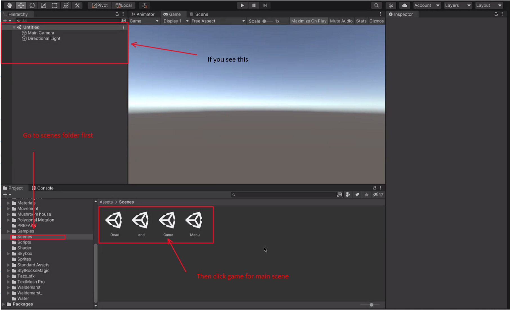
</p>

## Explanation of the game

This game is a First-Person Shooting (FPS) game. The background of this game is a magic world. The creation of this game is that instead of using regular guns and bullets, we chose to use magic projectiles. The world is very open-ended so that the player can explore the world freely. We also build the road as a hint. If the player walks along the road, he will find four different checkpoints(flags). Touching the flags will generate enemies. Enemies will chase the player, and some can shoot projectiles to attack the player. The main task of this game is to explore and destroy all enemies.

In the game, we used a wave system. The player will face the different enemies in each wave, there are total 4 checkpoints, and each checkpoint has 5 waves, so there are 20 waves. To win the game, the player need to finish all 20 waves in one go. The enemy in each wave will be generated randomly in different positions. After each checkpoint is completed, the player HP&mana will increase. Each checkpoint has different type of enemies with different features. Player need to make their own decision to choose which checkpoint starts, if they choose the correct order, they can easily pass all the waves. But if they choose the wrong order, they might end up with cannot pass the first wave. 

Player has initialized 100 HP and 100 mana, different enemy have different level of damage to the player. Player also has different shooting skills, each skills contribute different mana costs. The normal projectile will cost nothing. Different skills also have different level of damage and features.

The game randomly generates red and blue hearts for heal and maven, players can pick up those hearts to survive longer.

To win the game, complete 4 checkpoints 20 waves!!!

We also build different scenes for the start, end and dead menu in the game. If you click the options in the start menu, there will be detailed instructions on the game background and how to play the game.

<p align="center">
  
</p>

<p align="center">
  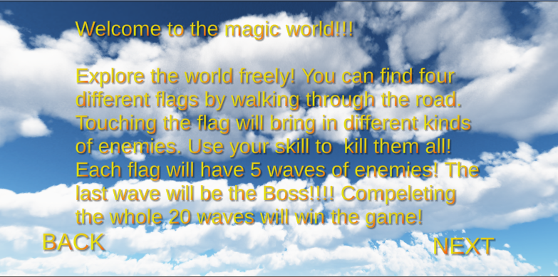
</p>

<p align="center">
  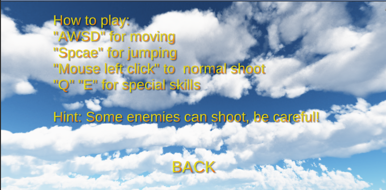
</p>


## How to play

The main play feature:

- "AWSD" for moving:

  <p align="center">
    
  </p>

  

  
- "mouse left click for normal shoot":

  <p align="center">
    
  </p>

  
- "Q and E for special skills":

  <p align="center">
    
  </p>
  <p align="center">
    
  </p>

  
- "Space" for jump：
  
<p align="center">
    
  </p>
  

- check points:

- <p align="center">
  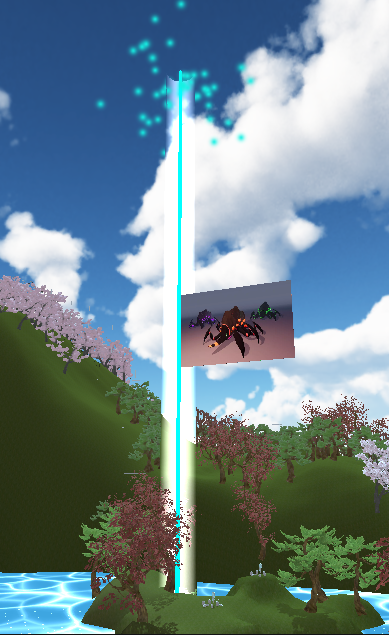
  </p>
  
  

  

## How objects and entities designed:

**camera**:

 As it is a first-person shooting game, we put the camera on the player and always look at the front. In the game view, if you move the mouse, the camera will follow the rotation and the player will rotate at the same angle. We also use the 'Mathf.SmoothDamp' function to make the camera's rotation look more smooth.

**player:**

Due to it is an FPS game, we sample used a capsule for the player entity and attached the camera to the capsule. To make the first-person value more real, we also attached a Magic wand to the capsule and let the camera shoot part of it.

<p align="center">
  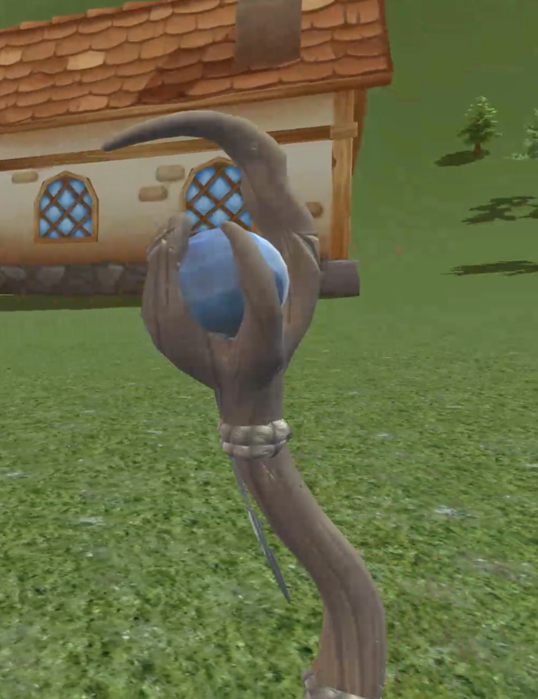
</p>


**heart:**


we also designed our own heart prefabs with a particle system .


<p align="center">
  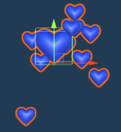
</p>
<p align="center">
  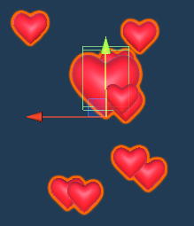
</p>

projectile:

We use the unity particle system to build many projectiles as the player's attack methods: The purple projectile is a simple attack and will not cost any MP. The fire projectile is one of the play's skills. It will cost MP and cause AOE damage.
These two projectiles can be shot and have impacts after they hit any objects. Another skill we build from particle system is flash. It will be created from the centre of the player and cause AOE damage and cost MP.

We also create a flash projectile. This projectile can also be shot, but it moves slowly, is hard to hit enemy, and costs a lot MP. But once it hit enemy it can cause huge damage.

We also add some hidden settings to make the game fun: fire will cause more damage to ghosts because they live in the dark and are afraid of fire. But fire can not cause much damage to spiders because they live in water, and flash will cause more damage to spiders. Players will find these out by using common sense.


<p align="center">
    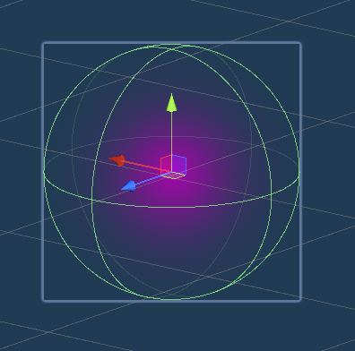
    </p>
<p align="center">
    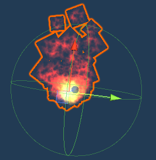
</p>
<p align="center">
    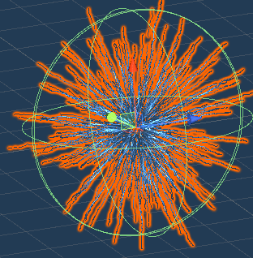
</p>
<p align="center">
    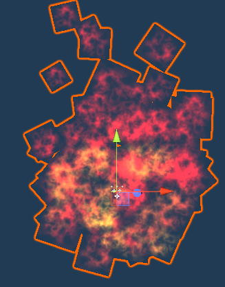
</p>
<p align="center">
    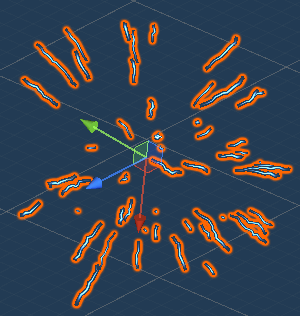
</p>

## Particle system:

we used many different particle system in this game:

Heart:

The red heart is the one we wanted to be marked. You can find it through Assets- PREFABS-HPwithParticleSystem. We firstly build this heart prefab by ourselves and then use a particle system to increase the effect. (We add the heart prefab itself into the mesh render of the particle system so the particles will be the shape of the heart. We also choose the shape as a sphere, so particles will be generated around the object)

<p align="center">
  
</p>
<p align="center">
  
</p>

We also build many other particle system for projectiles you can find them through Assets- PREFABS-(projectile, projectile1,projectile2,impact,impact1,impact2):  

projectile: The following shows the gifs of projectile particle system. As you can see when projectile hit an object the impact particle system will play.

<p align="center">
  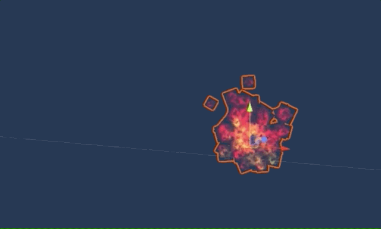
</p>
<p align="center">
  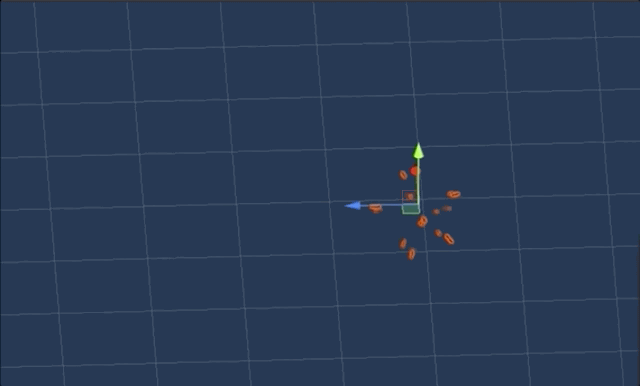
</p>
<p align="center">
  
</p>


## Procedural generation:

In this game, the enemy will used procedural generation for random generating in each wave also for the heart:

Enemy generator code: 

```c#
using System.Collections;
using System.Collections.Generic;
using UnityEngine;
using UnityEngine.UI;
using UnityEngine.SceneManagement;
[System.Serializable]
public class Wave{
    public string waveName;
    public int numOfEnemy;

    public GameObject[] typeEnemgy;
    public float intervale;
    
}
public class WaveSpaner : MonoBehaviour
{
    [SerializeField] Wave[] waves;
    [SerializeField] Transform[] spwanPoint;
    public Animator animator;
    public Text waveName;
    public int x, y;

    private Wave currentwace;
    private int currentWaveNum;
    private bool canSpanw = true;
    private bool canAnimate = false;
    private bool trigger = false;
    private float nextspawnTime;
    private HP hp;
    private PP pp;
    private bool trigger1 = true;
    private bool trigger2 = true;
    private bool trigger3 = true;
    private bool trigger4 = true;
    private int count = 0;
    

    private FPS fps;

    private void Awake(){

        fps = GameObject.FindGameObjectWithTag("Player").GetComponent<FPS>();
        hp = GameObject.FindGameObjectWithTag("Player").GetComponent<HP>();
        pp = GameObject.FindGameObjectWithTag("Player").GetComponent<PP>();
    }

    private void Update() {
        currentwace = waves[currentWaveNum];
        SpwanWave();
        if(count == 19){
            SceneManager.LoadScene("end");

        }
        
        GameObject[] totalEnemies = GameObject.FindGameObjectsWithTag("Enemy");
       
        if(totalEnemies.Length == 0 && currentWaveNum+1 != waves.Length && canAnimate){

            waveName.text = waves[currentWaveNum + 1].waveName;
            animator.SetTrigger("WaveComplete");
            count++;
            canAnimate = false;

            currentWaveNum++;
            canSpanw = true;
        }
    }
    void SpwanWave(){
        GameObject[] totalEnemies = GameObject.FindGameObjectsWithTag("Enemy");
        GameObject player = GameObject.FindGameObjectWithTag("Player");
    
        if(canSpanw && nextspawnTime < Time.time && trigger){

            GameObject randomEnemy = currentwace.typeEnemgy[Random.Range(0,currentwace.typeEnemgy.Length)];
            
            int p_x, p_z;
            p_x = Random.Range(-50,50);
            p_z = Random.Range(-50,50);
            
            Transform randomPoint = randomEnemy.transform;
            randomPoint.position = new Vector3(player.transform.position.x + p_x, player.transform.position.y+50, player.transform.position.z + p_z);

            Instantiate(randomEnemy,randomPoint.position,Quaternion.identity);
            currentwace.numOfEnemy--;
            nextspawnTime = Time.time + currentwace.intervale;
            if(currentwace.numOfEnemy == 0){
    
                canSpanw = false;
                canAnimate = true;
                
            }
            
        }
        if(currentWaveNum == 4 || currentWaveNum == 9 || currentWaveNum == 14 ){

                trigger =false;
                
                
                
            }
        if(totalEnemies.Length == 0&& currentWaveNum == 15){
                fps.Skybox = false;}
        if(currentWaveNum == 4 && totalEnemies.Length == 0 && trigger4){
            pp.maxPP = 180;
            
            hp.maxHP = 180;
            
            trigger4 = false;
            pp.currentPP = pp.maxPP;
            hp.currentHP = hp.maxHP;
            

        }

        if(currentWaveNum == 9 && totalEnemies.Length == 0 && trigger3){
            pp.maxPP = 260;
            
            hp.maxHP = 260;
            
            trigger3 = false;
            pp.currentPP = pp.maxPP;
            hp.currentHP = hp.maxHP;
            

        }

        if(currentWaveNum == 14 && totalEnemies.Length == 0 && trigger2){
            pp.maxPP = 400;
            
            hp.maxHP = 400;
            
            trigger2 = false;
            pp.currentPP = pp.maxPP;
            hp.currentHP = hp.maxHP;
            

        }


    }

    public void setTrigger(){
        this.trigger = true;
    }
 public void setAnimate(){
        this.canAnimate = true;
    }

    public void setCurrentWaveNum(int num){
        this.currentWaveNum = num;
    }
    
}
```

The new enemy will be generated when all the current enemies are killed. Every enemy will be randomly generated in a different location. The code below is the core for the procedural generation.

```C#
GameObject[] totalEnemies = GameObject.FindGameObjectsWithTag("Enemy");
        GameObject player = GameObject.FindGameObjectWithTag("Player");
    
        if(canSpanw && nextspawnTime < Time.time && trigger){

            GameObject randomEnemy = currentwace.typeEnemgy[Random.Range(0,currentwace.typeEnemgy.Length)];
            
            int p_x, p_z;
            p_x = Random.Range(-50,50);
            p_z = Random.Range(-50,50);
            Transform randomPoint = randomEnemy.transform;
            randomPoint.position = new Vector3(player.transform.position.x + p_x, player.transform.position.y+50, player.transform.position.z + p_z);
```

The code above shows how different enemies are randomly generating in randomly locations.  

The mean function in the code is **Instantiate**, and this method will bring the object into existence. It will clone the object original and returns the clone. This function makes a copy of an object similar to the duplicate command in the editor. When cloning a GameObject, all child objects and components will also be cloned with their properties set like those of the original object.

The active status of a GameObject at the time of cloning is maintained, so if the original is inactive, the clone is also created in an inactive state. Additionally, for the object and all child objects in the hierarchy, each of their Monobehaviours and Components will have their Awake and OnEnable methods called only if they are active in the hierarchy at the time of this method call.

## Shader

A render pipeline is a set of processes that takes the contents of a Scene and renders them on the screen.

In this game, we used built-in render pipeline and customer render pipeline. We used customer render pipeline to render the pool.

#### lab based shader

<p align="center">
  
</p>


The shader code below is used to colour the checkpoints. In this game, there are total 4 checkpoints, and each checkpoint has different colour. One of the checkpoint examples is shown above.  We use the code from the workshop as a base code. As you can see, the first pass is used to generate the blue colour for the cylinder. To make the checkpoint more easily found, we extend the code by writing another pass to generate the light around the cylinder. We set the light colour as white and chose the appropriate light size, power and intensity. Using this vertex shader, we can increase the effectiveness of the checkpoint, and it is very easy to control the input.

```HLSL
Shader "Unlit/blue"
{
    Properties
    {
        _LightSize("LightSize", Float) = 4 
        _LightPower("LightPower", Range(0.0,5)) = 2 
        _Intensity("Intensity", Range(0.0, 10)) = 1 
        _LightColor ("LightColor", Color) = (1,1,1,1) // set light color as white
        
    }
    SubShader
    {
        Tags { "RenderType"="Opaque" }
        LOD 100
    Pass //pass for main object(the cylinder)
		{
			CGPROGRAM
			#pragma vertex vert
			#pragma fragment frag

			#include "UnityCG.cginc"

			struct vertIn
			{
				float4 vertex : POSITION;
			};

			struct vertOut
			{
				float4 vertex : SV_POSITION;
			};
			vertOut vert(vertIn v)
			{
				vertOut o;
				o.vertex = UnityObjectToClipPos(v.vertex);
				return o;
			}
			
			fixed4 frag(vertOut v) : SV_Target
			{
				return float4(0.0f, 1.0f, 1.0f, 0.5f); // return bule color
			}
			ENDCG
		}
        Pass // pass for light around the object 
        {
			Cull Front //remove front so we can still see the main cylinder
            Blend SrcAlpha One
            CGPROGRAM
            #pragma vertex vert
            #pragma fragment frag
            #include "Lighting.cginc"

             uniform float4 _LightColor;
             uniform float  _LightSize;
             uniform float  _LightPower;
             uniform float  _Intensity;  
            struct appdata
            {
                float4 vertex : POSITION;
                float2 uv : TEXCOORD0;
                float3 normal : NORMAL;

                float4 tangent : TANGENT;

            };

            struct v2f
            {
                
                float4 vertex : SV_POSITION;
                float4 worldPos : TEXCOORD2;
				float2 uv : TEXCOORD0;
                float3 normal : TEXCOORD1;

            };
            v2f vert (appdata v)
            {
                v2f o;
                v.vertex.xyz += v.normal*_LightSize; 
                o.vertex = UnityObjectToClipPos(v.vertex);
                o.normal = mul(unity_ObjectToWorld, float4(v.normal,0)).xyz;
                o.worldPos = mul(unity_ObjectToWorld, v.vertex);
                o.uv = v.uv;
                return o;
            }

            fixed4 frag (v2f i) : SV_Target
            {
                half NormalDotVertex =  dot(normalize(i.normal), normalize(i.worldPos.xyz-_WorldSpaceCameraPos.xyz )); // use the postion of vertex world space - the position of vertex camera space
                float fresnel =pow(saturate(NormalDotVertex),_LightPower)*_Intensity;
                return float4(_LightColor.rgb,fresnel);
            }
            ENDCG
        }

    }
}
```

#### Non-lab based shader

<p align="center">
  
</p>

The shader code below is used to create pool effect which is shown in as .gif above.

```
Shader "Custom/Water"
{
    Properties
    {
        // the corresponding information of water's foam parts
        [Header(Foam)]
        _FoamTex("FoamTex", 2D) = "white" {}            // foam noise picture
        _FoamColor("FoamColor",Color) = (1,1,1,1)       // default water color
        _FoamRange("FoamRange",Range(0,1)) = 1          // foam range
        _FoamSpeed("FoamSpeed",Float) = 0.1             // foam flow speed
        _FoamNoise("FoamNoise",Float) = 1               // noise range

        [Header(WaterColor)]
        _ShallowColor("ShallowColor",Color) = (1,1,1,1) // water shallow color
        _DeepColor("DeepColor",Color) = (1,1,1,1)       // water deep color
        _DepthRange("DepthRange",Range(0,1)) = 1        // water depth range


        [Header(Wave)]
        //fluctuations in x- and z-direction
        _WaveFrequencySpeed("X Frequancy(x),X Speed(y),Z Frequancy(z),Z Speed(w),",Vector) = (0.2,1,0.2,1)

        [Header(Caustics)]
        _CausticTex("CausticTex", 2D) = "white" {}          // caustic texture
        _CausticColor1("CausticsColor1",Color) = (1,1,1,1)  // caustics color 1 and 2
        _CausticColor2("_CausticColor2",Color) = (1,1,1,1)

    }

    SubShader
    {
        Tags { 
            "Queue" = "Transparent" //change queue to transparent
        }

        Pass{
             HLSLPROGRAM                             
            #pragma vertex vert
            #pragma fragment frag
            #include "UnityCG.cginc"                
            #include "Lighting.cginc"

            // decelear shader variable
            float _FoamRange;
            float4 _ShallowColor;
            float4 _DeepColor;
            float4 _FoamColor;
            float _FoamSpeed;
            float _DepthRange;
            float4 _WaveFrequencySpeed;
            float _FoamNoise;
            float4 _CausticColor1;
            float4 _CausticColor2;
 
            sampler2D _CameraDepthTexture;
            sampler2D _FoamTex;
            float4 _FoamTex_ST;
            sampler2D _CausticTex;
            float4 _CausticTex_ST;

            // get CPU date to the vertex function
            struct Attributes
            {
                float4 vertex           :POSITION;  // vertex data
                float2 uv               :TEXCOORD0; // uv data
            };
             
            struct Varyings
            {
                float4 vertex           :SV_POSITION;   
                float2 uv               :TEXCOORD0;     
                float3 pos_world        :TEXCOORD1;     
                float4 pos_screen       :TEXCOORD2;     
            };

            Varyings vert( Attributes v)
            {
                Varyings o;
                //use cos to caculate x direction movement
                v.vertex.y += cos(_Time.y * _WaveFrequencySpeed.y +  v.vertex.x) * _WaveFrequencySpeed.x;
                //use sin to caculate y direction movement
                v.vertex.y += sin(_Time.y * _WaveFrequencySpeed.w +  v.vertex.z ) * _WaveFrequencySpeed.z;

                //Convert model vertices in model space to model vertices in clipping space
                o.vertex = UnityObjectToClipPos(v.vertex);

                //Convert model vertices in model space to model vertices in world space
                o.pos_world = mul(unity_ObjectToWorld,v.vertex.xyz);

                //Convert model vertices in model space to model vertices in screen space
                o.pos_screen = ComputeScreenPos(o.vertex);

                //pass the uv value
                o.uv = v.uv;

                return o;
            }
 
            float4 frag(Varyings i):SV_TARGET
            {
  
                //get the deepth and then divided by i.pos_screen.w to get each pixel location
                float2 screenUV = (i.pos_screen.xy)/i.pos_screen.w;
                //get pixel
                half depthScene = LinearEyeDepth(tex2D(_CameraDepthTexture,screenUV));
                //get cooresponding z value
                float surfaceDepth= UNITY_Z_0_FAR_FROM_CLIPSPACE(i.pos_screen.z);
                //get the intersection between scenes and water
                half depth = saturate(depthScene - surfaceDepth);

                //water color
                //the range between shallow color and deep color
                half water_depth = depth * _DepthRange; 
                //distinguish the shallow water and deep water
                float4 waterColor = lerp(_ShallowColor,_DeepColor,water_depth);

                half foamRange = depth * _FoamRange;
                //get foam texture and then adjust foam testure
                half foam_tex = tex2D(_FoamTex,i.pos_world.xz * _FoamTex_ST.xy + _Time.y * _FoamSpeed).r;
               
                // enhance the contrast of the foam texture
                foam_tex = pow(foam_tex,_FoamNoise);
                //step(a,b):a < b return 1
                half4 foam_color = step(foamRange,foam_tex) * _FoamColor;
                
                //sampled twice for focal dispersion and misaligned by _CausticTex_ST
                half caustic1 = tex2D(_CausticTex,i.uv + _CausticTex_ST.xy).r;
                half caustic2 = tex2D(_CausticTex,i.uv + _CausticTex_ST.zw).r;

                //two times scorched color
                half3 caustic_color1 = caustic1 * _CausticColor1.rgb;
                half3 caustic_color2 = caustic2 * _CausticColor2.rgb;
                
                //combine all
                float3 finalColor = foam_color.rgb + waterColor.rgb + caustic_color1+ caustic_color2;    
                return float4(finalColor,1);
 
            }
            ENDHLSL 
        }
    }
    FallBack "Packages/com.unity.render-pipelines.universal/FallbackError"
}

```

We built the water shader with HLSL code called "Water.shader". In the code, two textures are used. One is the 'foam noise picture'(to simulate foam on the water). Moreover, the other is 'caustic texture' (the main texture to simulate the water ripple). For watercolour, we have two colours: shallow color, which is the colour of the shallow; DeepColor the colour of the water. It also has a range called DepthRange between 0 and 1. Increasing the range will make the water looks darker. To make the water look like it is moving, we build a '_WaveFrequencySpeed' to sort the fluctuation frequency and speed in both x and z directions. You can also easily change the foam's speed and size by editing the 'FoamSpeed' and 'FoamNoise'. The more detailed processing is written in the code by comments.

Water shader lets us take advantage of the processing power of the graphics card processing unit(GPU) instead of relying solely on the system CPU. Also, the GPU can operate on multiple data streams simultaneously. 

Without a shader program and suitable hardware, updating an image may require several tenths of a second or more. Noticeable display updates may occur with CPU processing.

With a shader program, the display rate with the same amount of processing can be hundreds of frames per second. Display updates will be smooth with GPU processing. Display rates of hundreds of frames per second are not always useful, but more CPU resources are available for other operations when lower rates are used.

The GPU rendering acceleration can improve the graphics loading speed and reduce the burden on the CPU processor, making the system run more smoothly.

The key benefit of the shader is fast!

## Query and observation 

### question design:

1. How old are you?

   - [ ] Under 18
   - [ ] 18-24
   - [ ] 25-34
   - [ ] 35+

2. Do you typically play games?

   - [ ] Yes
   - [ ] No

3. What is your occupation?

   - [ ] Student
   - [ ] Full time worker
   - [ ] Part time worker
   - [ ] Other

4. Do you think the game runs smoothly?

   - [ ] Yes
   - [ ] No

5. Do you like the angle of the view? (first-person perspective)

   - [ ] Yes
   - [ ] No

6. Do you thin that this is a game that you could play again after you are finished?

   - [ ] Yes
   - [ ] No

7. Was the game easy to understand how to play?

   - [ ] Yes
   - [ ] No

8. How would you rate the setting of this game - by this, we mean the terrain, the scenery, the colors, the visibility?

   - [ ] highly dissatisfied
   - [ ] dissatisified
   - [ ] general
   - [ ] satisified
   - [ ] highly satisficed

9. How would you rate the shooting effect in this game ?

   - [ ] highly dissatisfied
   - [ ] dissatisfied
   - [ ] general
   - [ ] satisfied
   - [ ] highly satisfied

10. What advice do you have for us?

    ```
    
    ```

    

## **Query & observation**  


### observation technique

##### think aloud and cooperative evaluation

The players of this survey are primarily people of our age, friends, classmates etc., and we use zoom to observe their reactions get feedback while they play and record the time they played, which can assist us in obtaining user feedback and collecting advice from them. 
During the game, we encouraged the player to find as many bugs as possible and also frequently ask questions such as:

- How does the game control feel?
- Because it is an FPS game, is there a sense of vertigo?
- Is there anything to improve in this area?
- What you will do next?

##### post-task walkthrough method 

In order to better connect with players and obtain more real and direct feedback, we talked to them after playing the game through the zoom and asked for details about the game. For example:

- Do you think the game is highly playable?
- How do you think about this wave system?
- During the game, I saw you ... Why do you want to do this?
- During the game, why are you asking me ...?

##### physiological measurement 

Most player spent around 5-10 minutes to play the game. When they move the character in different directions, their eyes saccades. When they attack enemies, their eyes smooth pursuit. Thus, this kind of observation allows us to capture the user's reaction to the game directly. Meanwhile, facial expressions can also be used to understand the user's emotional experience at different game stages.

Additionally, we also allow players with smartwatches to detect heart rate while attacking monsters continuously. When the number of monsters increased or the game's difficulty went up, their heart rate increased significantly. This is also what we want to see.

##### Player's response during the observation:

We also give the player some instructions to perform specific tasks and get some feedback during the test. For example:

1. Go to a certain checkpoint.
   players' response:
     Hard to find the checkpoints
     Not sure what monsters this checkpoint will generate
     Do I have to go to this point first?
2. Try to kill enemies.
   players' response:
     The attack mode is too single enemy hard to kill.
     Enemies are generated too much
3. For each player, after a certain level of play, we will ask it to stop. Ask them if they want to continue playing
   players' responses:
     ​most players would like to continue playing, but some players who have already experienced wave system know what will happen in the next checkpoint, so they would like to stop playing.


##### Problems during the observation:

1. During the playing, if the player steps out of the terrain, the player will fall. This is not what we are expected. We ignored that players may go very far and get close to the border.  
2. During the playing, we also observed that the enemy's attack is too common. 
3. when other people played the game, we got some feedback that only adding particle system to the checkpoint cube and scaling the checkpoint cube bigger still made the player hard to find the route to the checkpoint. The people who played the game seem to get in the wrong direction easily, and players also need to keep their heads up frequently to check the direction. 


### Querying technique

Our objective is to survive, and after playing the game, we sent them a questionnaire to fill in to get players' suggestions on the game, making it more integrated and better. We attached a copy of our questionnaire at the [question design](#question-design). 

##### visualizing feedback

There are some graphs we made for visualizing comments from the player. Most people think our terrain design is quite good, some of them think it was general, and some made advice about terrain directly after they played that we need to add more detail to it. 

<p align="center">
  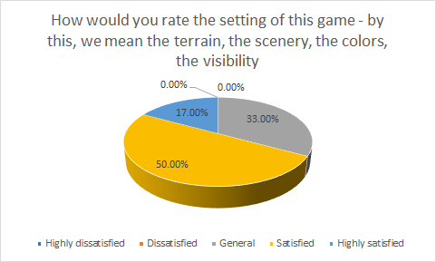
</p>


Most people found it reasonably good for the particle system, which is the shooting effect in this game. They also suggest that for making the game more interesting, we should apply more skills for attacking.

<p align="center">
  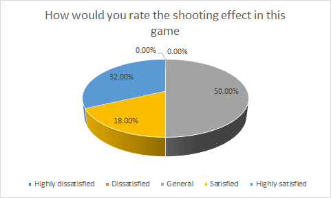
</p>


##### suggestion from questionnaire

Overall, below are some other helpful advice players have for us. 

1. it was pretty easy to die in this game. We should have some stuff to increase hp after getting an injury.
2. only FPS view. It seems very wired. Should add something into camera range.
3. the shooting skill is too plain.
4. the terrain is too simple, need to add some more stuff in.
5. the wave that will be generated in the fixed position seems not that interesting. Players can sort of predicate what will happen in the next few waves.


### Improvement

we did some implementations after query and observation, listed below:

1. when hp&mana decrease to a certain level, there will be a red heart which increases hp and blue heart, which increase mana generate for player
2. we add a magic wand in the camera view, which makes sense more real and have a rough idea for players to observe the skill launching process clearly and integrate the game experience.
3. we add some other keys for attacking. Some skills require consuming mana which is also a new feature of the game
4. we added more objects, like houses, different styles of trees, and a pool to make it more complete
5. we changed our game logic a little bit. Instead of simply wave system, we added 4 checkpoints, and each checkpoint will generate corresponding enemies with different features. Players need to go to those 4 checkpoints to kill the enemy and complete all the waves to win. 
6. to prevent players from falling when the player reaches the border of the terrain, we added an air wall to stop the player from moving. 
7. to make the game more fun and not too monotony, we create an enemy shooting feature. Those enemies will be able to aim player and shoot projectiles towards the player.
8. to make player life easier, we drew some routes to guide the player to the checkpoints. 
9. We have also reduced the number of monsters generated each time and the corresponding HP while also increasing the attack power of players in the face of different monsters

## Technologies

Project is created with:
* Unity 2021.1.13f1
* Ipsum version: 2.33
* Ament library version: 999
* C# TargetFrameworkVersion : v 4.8
* Clipper：GIPHY CAPTURE


## Member Contribution:

| Name       | Student ID | contributions:                                               |
| ---------- | ---------- | ------------------------------------------------------------ |
| Yihang Liu | 1061578    | Come up with an idea of this game design, and code logic for player movement, shooting projectile, enemy and heart procedural generation. Created Water shader for the game |
| lihui Hu   | 1074459    | Particpate game designing process, preparing appropriate enemies model, editing game demo video and report. |
| Zian Wang  | 1074055    | Build the game sence, terrain, trees, Start End menu. Import and build assets. Recording game demo video. Design player's attack skills(particle systems). Particpate code logic and report. |
| zhiwei liu | 1166089    | Participate game design process, editing game demo video and report. |


## Reference:

Kevin Iglesias. 2021. Basic Motions FREE. https://assetstore.unity.com/packages/3d/animations/basic-motions-free-154271#reviews

Unity Technologies. 2020. Standard Assets. https://assetstore.unity.com/packages/essentials/asset-packs/standard-assets-for-unity-2018-4-32351#content

Waldemarst. 2020. Japanese Garden Pack https://assetstore.unity.com/packages/3d/vegetation/trees/japanese-garden-pack-179492

LowlyPoly. 2019. Stylized Fantasy House. https://assetstore.unity.com/packages/3d/environments/stylized-fantasy-house-153587

Vladimir Trofimov. 2017. Mushroom House. https://assetstore.unity.com/packages/3d/environments/fantasy/mushroom-house-61027

Evgenia. 2017. Baker's House. https://assetstore.unity.com/packages/3d/environments/fantasy/baker-s-house-26443

Comeback. 2021. Stylized Rocks with Magic Rune. https://assetstore.unity.com/packages/3d/props/stylized-rocks-with-magic-rune-192933

ProAssets. 2016. Free HDR Sky. https://assetstore.unity.com/packages/2d/textures-materials/sky/free-hdr-sky-61217

Dr.Game. 2015. Flight Magic SFX. https://assetstore.unity.com/packages/audio/sound-fx/flight-magic-sfx-32895

Meshtint Studio. 2020. Meshtint Free Polygonal Metalon. https://assetstore.unity.com/packages/3d/characters/creatures/meshtint-free-polygonal-metalon-151383

Dungeon Mason. 2020. Dragon the Soul Eater and Dragon Boar. https://assetstore.unity.com/packages/3d/characters/creatures/dragon-the-soul-eater-and-dragon-boar-77121

GrigoriyArx. 2016. Goblin robber. https://assetstore.unity.com/packages/3d/characters/humanoids/fantasy/goblin-robber-66959

Dante's anvil. 2021. Undead Skeleton Enemies. https://assetstore.unity.com/packages/3d/characters/creatures/undead-skeleton-enemies-192820

TS WORK. 2018. Fantasy Monster(Wizard) DEMO. https://assetstore.unity.com/packages/3d/characters/creatures/fantasy-monster-wizard-demo-103037

Blink. 2021. Free RPG Weapons. https://assetstore.unity.com/packages/3d/props/weapons/free-rpg-weapons-199738

VGcomposer. 2019. Action RPG Music Free.
https://assetstore.unity.com/packages/audio/music/action-rpg-music-free-85434

 
